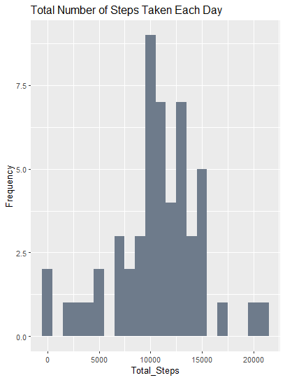

## Loading and preprocessing data

### Import Libraries

    library('magrittr')
    library('dplyr')
    library('ggplot2')
    library('tidyr')
    library('patchwork')

### Load Data

    activity <- read.csv("~/Online Courses/Johns Hopkins University Data Science Foundations using R Specialization/Assignment/Module 5/RepData_PeerAssessment1/activity.csv")

### View structure of data

    str(activity)

    ## 'data.frame':    17568 obs. of  3 variables:
    ##  $ steps   : int  NA NA NA NA NA NA NA NA NA NA ...
    ##  $ date    : chr  "2012-10-01" "2012-10-01" "2012-10-01" "2012-10-01" ...
    ##  $ interval: int  0 5 10 15 20 25 30 35 40 45 ...

### Data Cleaning

    # Convert date into class date 
    activity <- activity %>%  
      mutate(date = as.Date(as.character(date), "%Y-%m-%d"))

    # Check class of date 
    class(activity$date)

    ## [1] "Date"

## Analysis

### Total number of steps taken per day

    # Create a data frame that shows the total number of steps each day 
    dailysteps <- aggregate(steps ~ date, data = activity, sum, na.action = na.pass)
    colnames(dailysteps)[colnames(dailysteps) == 'steps'] <- 'total_steps'

    # Plot histogram of total steps taken each day
    ggplot(dailysteps, aes(x = total_steps)) +
      geom_histogram(binwidth = 1000, fill = "lightsteelblue4") +
      labs(x = "Total_Steps", y = "Frequency", title = "Total Number of Steps Taken Each Day")

### Mean and median total number of steps taken per day

    tdsmean <- round(mean(dailysteps$total_steps, na.rm = TRUE), 2)
    tdsmedian <- round(median(dailysteps$total_steps, na.rm = TRUE), 2)
    tdsmean_median <- data.frame(
      Metric = c("Mean", "Median"),
      Steps = c(tdsmean, tdsmedian)
    )
    tdsmean_median

    ##   Metric    Steps
    ## 1   Mean 10766.19
    ## 2 Median 10765.00

### Average daily activity pattern

    # Create a data frame on average number of steps taken for all days per interval 
    intervalsteps <- aggregate(steps ~ interval, data = activity, mean)
    intervalsteps$steps <- round(intervalsteps$steps, 2)
    colnames(intervalsteps)[colnames(intervalsteps) == "steps"] <- "average_steps"

    # Plot average daily activity pattern
    ggplot(intervalsteps, aes(x = interval, y = average_steps)) +
      geom_line(type = "l", color = "lightsteelblue4") +
      labs(x = "5_Minute_Interval", y = "Average_Steps", title = "Average Daily Activity Pattern")

Interval 835 contains the maximum number of steps.

    # Interval with the maximum number of steps 
    ## Find index of interval with max average steps 
    which.max(intervalsteps$average_steps)

    ## [1] 104

    ## Find the interval through index 
    intervalsteps$interval[104]

    ## [1] 835

### Imputing Missing Values

Total number of missing values is 2304.

    sum(is.na(activity))

    ## [1] 2304

Missing values were filled up using mean values from 5-minute interval.

### New dataset with missing data filled in

    # Merge mean steps per 5-minute interval with original data frame 
    activity2 <- activity %>%  
      left_join(intervalsteps, by = "interval")

    # Fill missing value with mean steps per 5-minute interval
    activity2 <- activity2 %>% 
      mutate(steps = ifelse(is.na(steps), average_steps, steps)) %>% 
      select(-average_steps)

    # Rearrange column 
    activity2 <- activity2[, c(2, 3, 1)]
    head(activity2)

    ##         date interval steps
    ## 1 2012-10-01        0  1.72
    ## 2 2012-10-01        5  0.34
    ## 3 2012-10-01       10  0.13
    ## 4 2012-10-01       15  0.15
    ## 5 2012-10-01       20  0.08
    ## 6 2012-10-01       25  2.09

### Total number of steps taken per day

    # Create a data frame that shows the total number of steps each day 
    dailysteps2 <- aggregate(steps ~ date, data = activity2, sum)
    colnames(dailysteps2)[colnames(dailysteps2) == "steps"] <- "total_steps"

    # Plot histogram of total steps taken each day 
    ggplot(dailysteps2, aes(x = total_steps)) + 
      geom_histogram(binwidth = 1000, fill = "lightsteelblue4") +
      labs(x = "Total_Steps", y = "Frequency", title = "Total Number of Steps Taken Each Day")

### Mean and median total number of steps taken per day

    tdsmean2 <- round(mean(dailysteps2$total_steps), 2)
    tdsmedian2 <- round(median(dailysteps2$total_steps), 2)
    tdsmean_median2 <- data.frame(
      Metric = c("Mean", "Median"),
      Steps = c(tdsmean2, tdsmedian2)
    )
    tdsmean_median2

    ##   Metric    Steps
    ## 1   Mean 10766.18
    ## 2 Median 10766.13

Mean and median values are rather close to the values from first part of
the assignment.

### Differences in activity patterns between weekdays and weekdends

#### Create new factor variable in data set

    day <- weekdays(activity2$date)
    activity3 <- activity2 %>% 
      mutate(day) 
    activity3  <- activity3 %>%
      mutate(day_type = ifelse(day %in% c("Saturday", "Sunday"), "Weekend", "Weekday"))

Average steps taken are higher during the weekends as compared to
weekdays.

#### Average daily activity pattern

    # Create a subset data for average number of steps per interval for weekdays 
    intervalstepsweekdays <- subset(activity3, day_type == "Weekday") 
    intervalstepsweekdays <- aggregate(steps ~ interval, data = intervalstepsweekdays, sum)

    # Create a subset data for average number of steps per interval for weekends
    intervalstepsweekends <- subset(activity3, day_type == "Weekend") 
    intervalstepsweekends <- aggregate(steps ~ interval, data = intervalstepsweekends, sum)

    # Plot average daily activity pattern for weekdays and weekends 
    p1 <- ggplot(intervalstepsweekdays, aes(x = interval, y = steps)) + 
            geom_line(type = "l", color = "lightsteelblue4") +
            labs(x = "5_Minute_Interval", y = "Average_Steps", title = "Weekdays")

    p2 <- ggplot(intervalstepsweekends, aes(x = interval, y = steps)) + 
            geom_line(type = "l", color = "lightsteelblue4") +
            labs(x = "5_Minute_Interval", y = "Average_Steps", title = "Weekends")

    combinedplot <- p1 + p2 + plot_layout(nrow = 2) +
      plot_annotation(title = "Average Daily Activity Pattern")

    combinedplot

